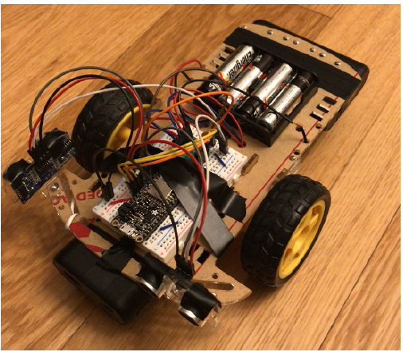
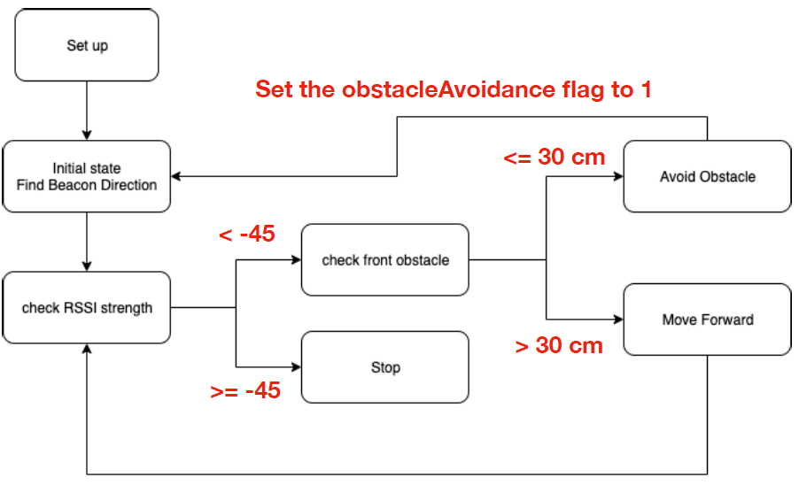
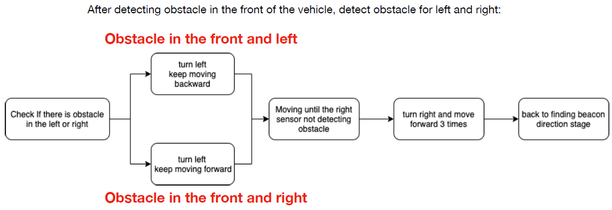

# Path-finding-Obstacle-avoidance-vehicle
Nov, 2019- Dec, 2019
<h3>Picture of the embedded system car</h3>

<h3>Materials</h3>
<ul>
	<li>car kit with two motors</li>
	<li>Feather HUZZAH esp8266 microcontroller</li>
	<li>Motor Driver (DRV8833)</li>
	<li>2 x ultrasonic sensors</li>
	<li>4 x AAA batteries</li>
<li>Portable battery for powering the microcontroller</li>
<li>tape, wire</li>
</ul>
<h3>Block diagram of the algorithm</h3>

<h3>Block diagram for the obstacle avoidance algorithm</h3>

<h3>Implemented functions</h3>

car movement 
<ul>
	<li>void moveForward(), void moveBackward(): 
		move car forward/backward, using delay() to control moving distance
	</li>
	<li>void turnLeft(), void turnRight(): 
		move car forward/backward, using delay() to control moving distance
	</li>
	<li>void turnLeftUnit(), void turnRightUnit(): 
		turn car 30 degrees left/right for fine-grained beacon finding, using delay() to control turning degrees
	</li>
</ul>

Signal strength (RSSI) measurement 
<ul>
	<li>int calAvgRSSI(int num): 
		calculate avg RSSI signal, using num to specify how many RSSI signal to be used for computing the average (num = 120 for current implementation).
	</li>
</ul>

Obstacle detection 
<ul>
	<li>int calDistance(int echoPin): 
		calculate measured distance in cm from the ultrasonic sensor, using echoPin to specify either front/right sensor
	</li>
	<li>int calAvgDistance(int echoPing, int num): 
		calculate avg distance in cv from the ultrasonic sensor, using num for specifying the number of data for computing the average.
	</li>
</ul>

Find beacon 
<ul>
	<li>void findDirection( ): 
		Find the coarse direction of the beacon (4 directions, turn 90 degrees each).
	</li>
	<li>void findDirectionFine( ): 
		Find the find-grained direction for the beacon, (3 directions, turn around 30 degrees each).
	</li>
</ul>